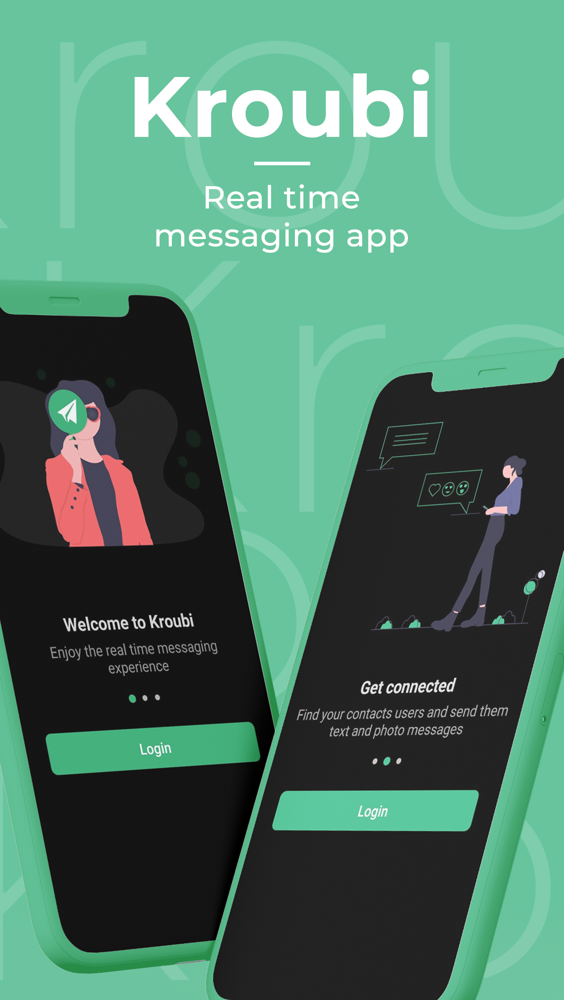
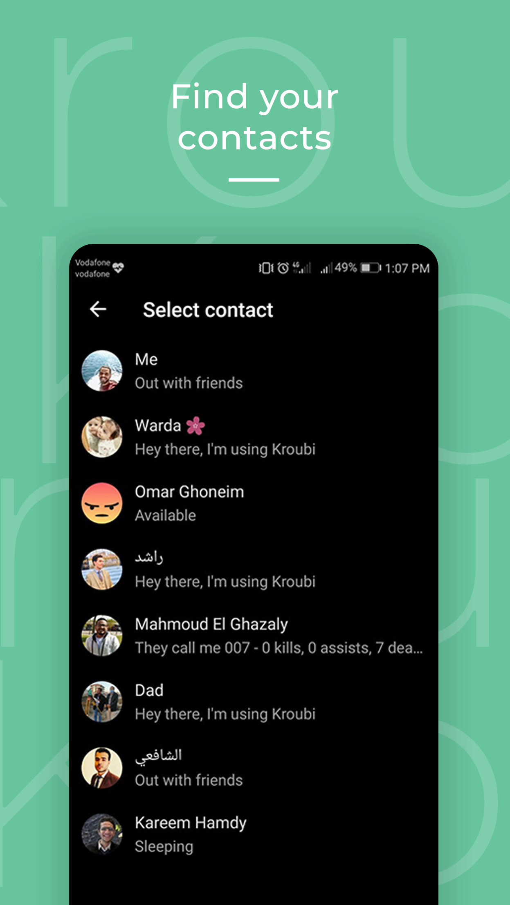
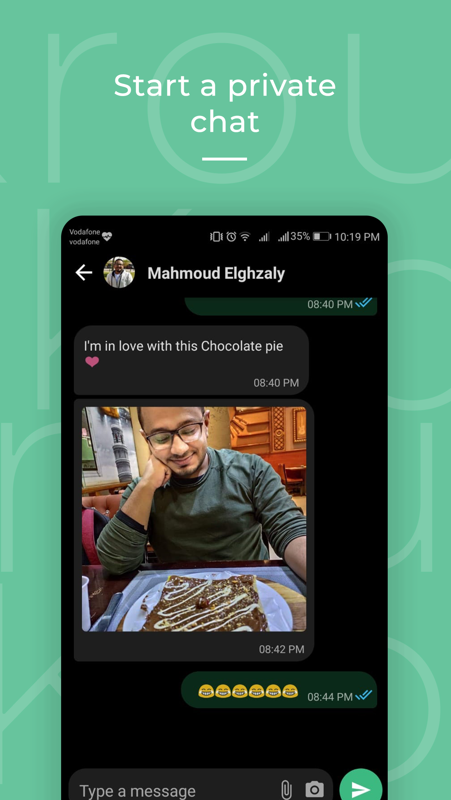
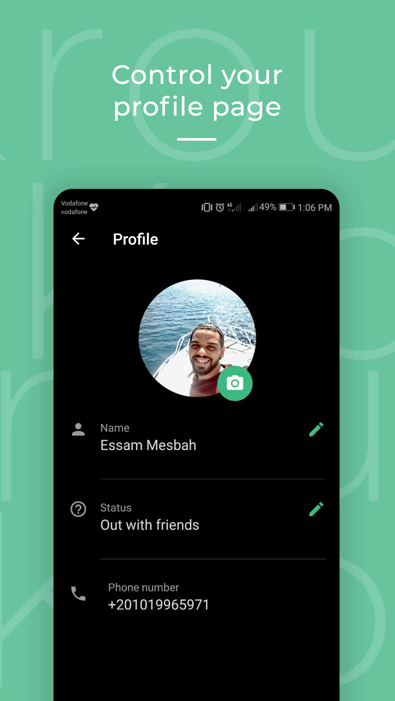
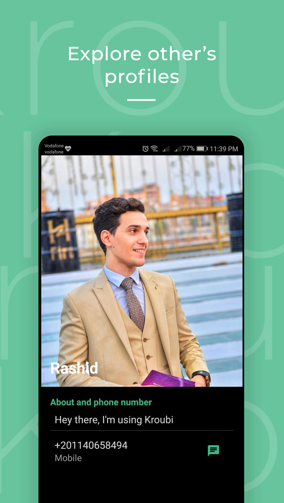

# Kroubi Chat App 
Kroubi is a realtime chat app integrated with firebase and inspired its ui from Whatsapp . 

## screenShots 

 

 

## Features
* Login with phone number using Firebase Auth.
* Fetching user contacts and query the registered users.
* A realtime messaging experience using firebase realtime database.
* Push notifications when new message recieved using Firebase Cloud Messaging [FCM].
* Online state , Typing , Unseen messages count, sent & seen message .
* User Profile including editing profile picture, name and status .
* Nice Animations using motionLayout and others ...  

## Demo 
https://www.youtube.com/watch?v=xB1yqXTxJRk

